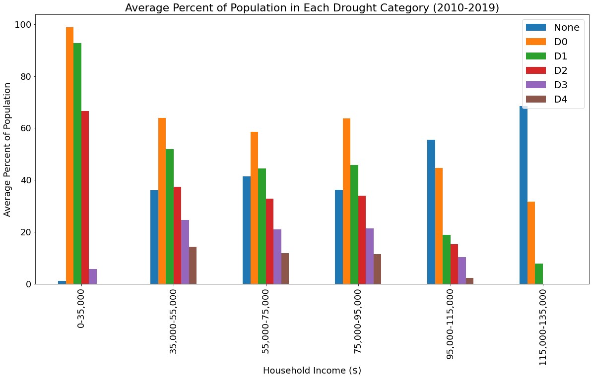
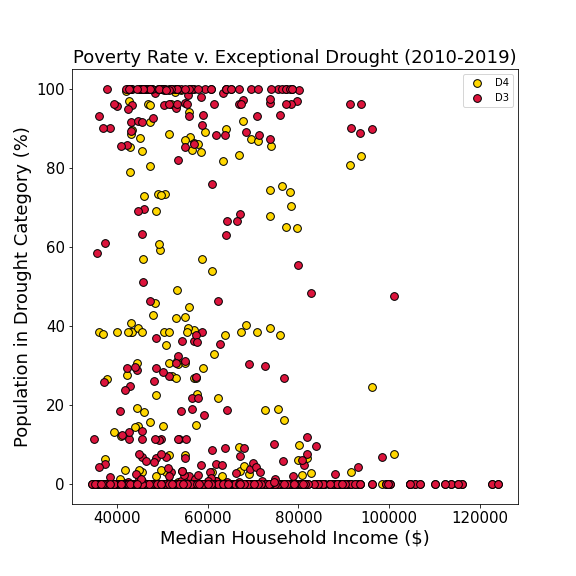
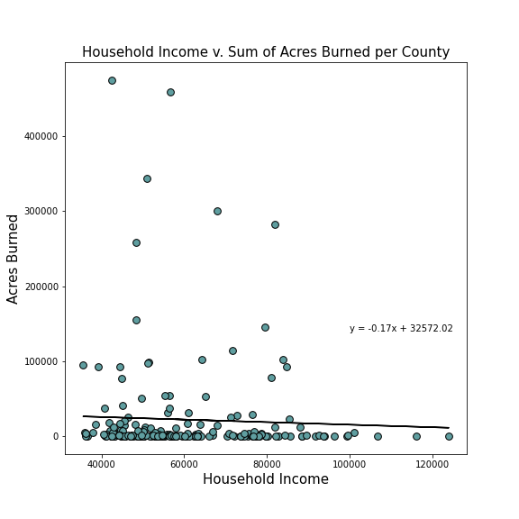
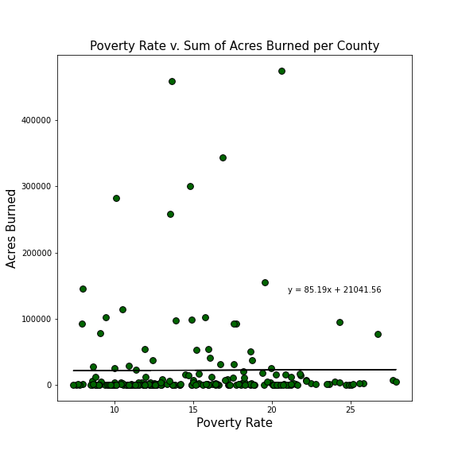
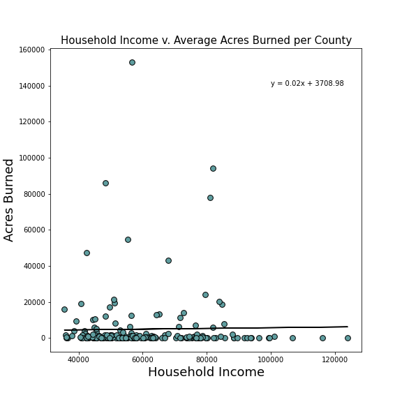

# Project_1
## Does income level determine exposure to extreme weather in California?
 
# Background
* Motivation: Income level can determine exposure to extreme weather across the globe. Lim et al. 2020 found that in the United States from 1996-2001, higher income reduced extreme heat vulnerability, while poverty intensified extreme heat vulnerability
* Hypothesis: In the state of California, counties with lower income and higher poverty rates have more exposure to extreme weather (high temperatures, extreme drought, wildfires). 
* 
The project is carried out in `Jupiter notebook` and has two parts as below:\
[Data processing](https://github.com/KeSavanh/Project_1/blob/main/Main/Data_process.ipynb)\
[Analysis](https://github.com/KeSavanh/Project_1/blob/main/Main/Analysis.ipynb)\

The slides using for presentation the analysis results is below:
[Presentation](https://docs.google.com/presentation/d/1_mFfFTWAzaT6WqJJRVio4y5oVnrvanC3miMxWxwGdfY/edit#slide=id.p)

The summary of the project is linked below:
[Project Summary](https://docs.google.com/document/d/1NnKWNrwLr9XuaRLw8D05oUPrhxtERhdI/edit)

# Table of Contents

* [Motivation and Questions](#Motivation-and-Questions)
* [Data source](#Data-source)
* [Data Cleanup and Exploration](#Data-Cleanup-and-Exploration)
* [Data Analysis](#Data-Analysis)
    * [Max Temperature and Household Income](#Max-Temperature-and-Household-Income)
    * [Max Temperature and Poverty Rates](#Max-Temperature-and-Poverty-Rates)
    * [Percentage of Population in Each Drought Catagory](###Percentage-of-Population-in-Each-Drought-Catagory)
    * [Drought and Household Income ](#Drought-and-Household-Income)
    * [Drought and Poverty Rates](#Drought-and-Poverty-Rates)
    * [Total Acres Burned and Household Income](#Total-Acres-Burned-and-Household-Income)
    * [Total Acres Burned and Poverty Rates](#Total-Acres-Burned-and-Poverty-Rates)
    * [Average Acres Burned and Household Income](#Average-Acres-Burned-and-Household-Income)
    * [Average Acres Burned and Poverty Rates](#Average-Acres-Burned-and-Poverty-Rates)
* [Summary and Discusion](#Summary-and-Discusion)
    
    
##  Motivation and Questions
The objective of this analysis is to answer the questions below:
    * Do populations with lower income & higher poverty rates experience higher temperatures?
    * Are populations with lower income & higher poverty rates more likely to experience extreme and exceptional drought conditions? 
    * Do counties with higher poverty rates experience more wildfires than counties with lower poverty rates?
## Data source
Household income and poverty rate data from 2010 to 2019 was retrieved by performing API calls from [United States Census Bureau](https://www.census.gov/data/developers/guidance/api-user-guide.Available_Data.html). Data set of Daily Maximum Temperature (F) was obtained from [NOAA National Centers for Environmental Information ](https://www.ncei.noaa.gov/access/search/data-search/global-hourly?dataTypes=TMP&bbox=42.002,-124.393,32.536,-114.125&place=State%20or%20Province:25&startDate=2010-01-01T00:00:00&endDate=2019-12-31T23:59:590) in `csv` format and the same with drought severity which contains the percentage of the population experiencing exceptional drought and was derived from  [U.S. Drought Monitor ](https://droughtmonitor.unl.edu/DmData/DataDownload/ComprehensiveStatistics.aspx). Lastly, wildfire data from 2013 to 2019, was acquired from [Kaggle.com](https://www.kaggle.com/ananthu017/california-wildfire-incidents-20132020/metadata) which includes includes acres burned. The datasets were gathered in the following subfolder [Resources](https://github.com/KeSavanh/Project_1/tree/main/Main/Resources)

## Data Cleanup and Exploration
The data cleaning process was carried out using `jupyter notebook`, `pandas library`, and some relevant modules. 
The performance includes:
Creating and merging data frames.
Renaming columns.
Identifying and removing nulls.
Dropping and filtering unrelated columns.
The cleaned data was saved to a separate folder [data_output](https://github.com/KeSavanh/Project_1/tree/main/Main/data_output) and be ready for analysis.

## Data Analysis
Analysis and visualization was conducted in a seperate notebook [Analysis](https://github.com/KeSavanh/Project_1/blob/main/Main/Analysis.ipynb). Plots from the analysis were saved in [Figures](https://github.com/KeSavanh/Project_1/tree/main/Main/data_output/Figures)
### Max Temperature and Household Income

### Max Temperature and Poverty Rates

### Percentage of Population in Each Drought Catagory

### Drought and Household Income 

### Drought and Poverty Rates

### Total Acres Burned and Household Income

### Total Acres Burned and Poverty Rates

### Average Acres Burned and Household Income

### Average Acres Burned and Poverty Rates

## Summary and Discusion
* Results Summary: Counties with lower median household incomes and higher poverty rates experienced higher daily maximum temperatures but similar exposure to extreme and exceptional drought categories. 

* Temperature: 
    * High poverty rate and low income were only correlated with higher maximum daily temperatures

* Drought: 
    * Most income groups experience some extreme and exceptional drought conditions 

* Wildfire: 
    * There does not appear to be a strong correlation between income level and wildfires within California counties.

* Next steps
    * Compare household income and poverty in counties that experience extreme temperatures (>103.9 F, exceptional drought, and high wildfire frequency)  
    * Extend analysis to other western states experiencing extreme heat, drought, and wildfires

 
# Team members:
   * Katlin Bowman
   * Chey Flammer
   * Melina Heredia
   * Vilaysack Khonsavanh

